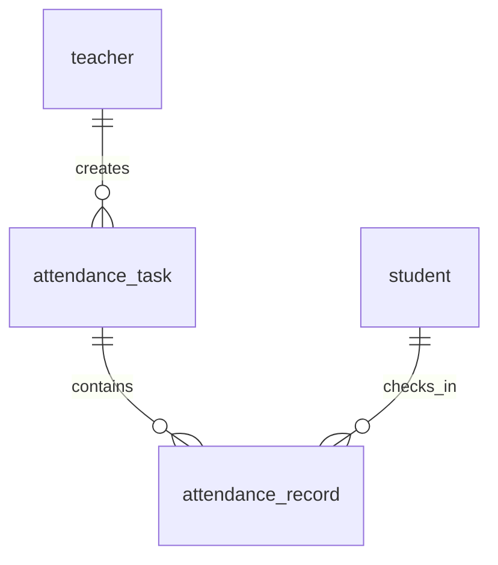

# 演示与答辩手册

## 准备

1. 按 README 安装、初始化、生成演示数据，运行 `python app.py`（或直接调用 `.venv\Scripts\python.exe`）。
2. 统一打开 `http://127.0.0.1:5000`。教师用 T001，学生用 S001，密码均为 Demo123!。
3. 两个身份使用不同浏览器/独立配置文件，或者依次退出再登录。同一浏览器两个普通标签页不隔离登录。

## 真实定位闭环（需现场设备验证）

教师：登录 → 创建签到任务 → 选软件一班 → 北京时间设置当前有效区间 → “使用当前位置作为签到中心” → 允许位置权限 → 检查经纬度和精度 → 填 200 米半径 → 创建。

学生：登录 → 只看到软件一班任务 → “定位并签到” → 获取本次位置 → 显示精度和服务端中文结果 → 成功后按钮显示已签到 → 查看个人记录。

教师：刷新任务结果 → 应到 5 人、已签到 1 人、未签到 4 人 → S001 显示服务器签到时间与计算距离，其他四人显示未签到。任务截止后，其他四人显示缺勤。

定位权限被拒绝、设备定位不可用或超时时，应看到中文错误，并可重新点击。定位精度差会提示更换环境；系统不会扩大围栏。

## 明确标记的模拟演示

这是**浏览器开发者工具模拟定位**，用于验证业务与界面，不等于真实物理位置实测，不改变后端规则。

1. 教师新建任务，名称写 `[模拟演示] 围栏验收`，软件一班、当前有效时间，中心纬度 `39.9042`、经度 `116.4074`、半径 `200` 米。
2. 在学生浏览器打开开发者工具，使用命令菜单搜索 `Sensors`（传感器），选择自定义 Location，填模拟纬度 `39.9042`、经度 `116.4174`，精度如有选项填 `10` 米。保留 localhost 正常定位权限。
3. 点击定位签到：提示距离中心约 850 多米、允许 200 米、超出约 650 多米（以实际计算显示为准）。教师刷新，应仍为 0 人成功。
4. 在 Sensors 改为与中心相同的坐标，再点击“重新定位并签到”：成功，距离 0 米。教师刷新：1/5 人成功。学生个人记录出现这次签到。
5. 重复签到：成功前可复制学生任务页打开另一个同 session 标签，保留其旧“定位并签到”按钮；成功后切到旧标签再次点击，应返回“你已签到，请勿重复提交”。刷新后显示已签到。数据库仍只有一条记录。
6. 时间演示：教师另建未来任务，学生看见未开始；另建过去任务，教师对未签到学生显示缺勤。精确边界由 pytest 固定时钟测试验证。
7. 班级演示：用 S006 登录，只能看软件二班；用 T002 登录，不能查看 T001 的任务结果链接。
8. 权限失败演示：Sensors 的“位置不可用”选项或浏览器拒绝位置权限可验证定位失败及重试。恢复正常设置后重新定位。
9. 演示完关闭位置模拟、恢复原设置，不把模拟记录解释为真实学生到场。

正式学生页面没有手动坐标输入，正式接口没有绕过时间、身份、班级或距离的参数。精度只用作提示，不作为扩围依据。

## 原始四表与关系

学生管理升级另增加固定名单和调整审计四表，规则见 [MANAGEMENT.md](MANAGEMENT.md)。

- teacher 独立保存工号、姓名和密码哈希。
- student 独立保存学号、姓名、班级和密码哈希。
- attendance_task 通过 teacher_id 关联教师；通过 target_class_name 与学生 class_name 匹配目标名单。班级不是外键，是本版明确采用的最小假设。
- attendance_record 通过 task_id 和 student_id 关联任务与学生，二者联合唯一；仅保存 status=success。签到时间、坐标和计算距离供教师核验。

一个教师可建多个任务，一个学生可有多个任务记录，但一个学生对同一任务至多一条成功记录。无需预先插入“未签到”记录，失败也不占用唯一约束名额。

## 核心代码讲解

1. `app.create_app(config)`：初始化 Flask、db、CSRF 与蓝图。测试传临时数据库和固定时钟，避免影响开发数据。
2. `routes/auth.py`：密码哈希校验，登录成功清空旧 session，存角色和用户 id；装饰器从对应表加载身份，阻止角色越权。
3. `routes/teacher.py`：创建时校验现有班级、时间顺序、标题、经纬度、有限正半径。提交后重定向。结果从目标班全部学生出发匹配记录，绝不把别班学生算缺勤。
4. `services/time_utils.py`：datetime-local 按 UTC+08:00 解释，转为无时区 UTC 入库。统一服务端时钟及状态函数，显示再转北京时间。
5. `static/js/location.js`：点击时请求一次 getCurrentPosition，高精度、10 秒定位超时、maximumAge=0；忙碌时禁用按钮，失败恢复，成功禁用；fetch 携带 CSRF token。
6. `services/geofence.py`：Haversine 使用弧度、地球半径 6371000 米，中间值夹在 [0,1] 避免舍入导致 asin 越界。距离计算全部在服务端执行。
7. `routes/student.py`：身份与 CSRF → 任务与班级 → 闭区间时间 → 重复 → 坐标 → 距离 → 保存。比较原始距离，只有显示时取两位小数。唯一约束竞争冲突 rollback 后返回 409，其余数据库错误返回保存失败。

全局 CSRFProtect 在视图执行前保护全部 POST；角色与任务授权随后由路由执行，所有校验通过才可能写入。测试没有全局关闭 CSRF。

## 现场验收清单

- [ ] 教师和学生能登录、退出，错误密码被拒绝。
- [ ] 创建表单能定位填入中心，也支持教师手工输入；非法数值被拒绝。
- [ ] 学生只看本班任务；教师只看自己任务。
- [ ] 学生签到按钮显示定位中、精度、结果，失败可重试。
- [ ] 围栏内成功，围栏外失败且不产生记录。
- [ ] 重复签到不产生第二条记录，旧页面提交有中文提示。
- [ ] 教师名单覆盖目标班全部学生；缺勤不含其他班级。
- [ ] 学生个人记录只含本人成功签到。
- [ ] 未开始/进行中/已结束状态及北京时间显示正确。
- [ ] 现场使用的模拟数据与真实位置测试明确区分。
- [ ] 本机重新启动与完整 pytest 命令能执行。

以上是可重复的人工清单，实际本次执行情况见 TESTING.md，未勾选不代表功能未实现。

## 已知边界

客户端坐标可被模拟，系统不是反作弊平台；定位误差不受程序控制。现已支持班级调整并为任务保留固定名单；不支持任务编辑删除、账号密码管理或公开注册。地图用于显示范围，不包含地图选点、后台追踪或外部位置服务 API。

本机 localhost 与手机通过局域网 IP 访问不同。当前服务仅本机可达；手机需额外可达服务与可信 HTTPS 等条件，普通 HTTP 局域网访问通常不能定位。无需也不应关闭浏览器安全机制。真实手机、真实设备位置精度未实测；本次浏览器的合成定位验收应单独说明。

## 地图版演示补充

1. 教师创建任务时获取或输入中心，查看蓝色圆圈。把半径由 200 改为 500 米，观察圆圈和地图视野更新；恢复所需半径后提交。
2. 学生展开“查看签到范围”，只展示当前任务中心和范围。实际点击定位签到后，橙点表示本次位置；蓝色圆圈才是允许范围，橙色虚线圈仅表示定位精度估计。
3. 使用上文明确标记的模拟坐标，分别演示圈外和圈内。距离计算和实际成功结果仍以服务器返回为准。
4. 教师结果页的“查看学生签到位置”下拉列表可选择成功记录，在在线地图上核对。
5. 用开发者工具只阻止 `tile.openstreetmap.org`（不要阻止 localhost），观察失败提示，并确认仍能提交签到。解除阻止后点击“重新加载地图”重试。
6. 在线底图署名必须保留，不提供批量下载或离线地图包。网络不可用时仅显示失败提示，不再提供本地示意图。

## 学生管理演示

1. 教师进入“学生管理”，按学号查询学生，打开详情。
2. 修改所属班级并填写原因，保存后查看修改日志。进入原任务结果，确认该学生仍在固定名单、应到人数不变。
3. 在自己发布且已经开始的任务中选择一位未签到学生，点击“调整签到”，选择教师补签、填写原因并保存。
4. 结果页应到不变、已签到加一；补签显示无定位数据。学生个人记录能看到来源与原因。
5. 撤销后有效签到减少；恢复原始状态后以原定位记录为准。对无原始定位记录的演示补签，恢复后应回到未签到或缺勤。
6. 演示结束将临时转班和签到覆盖恢复；日志保留并用“模拟验收”原因注明。
